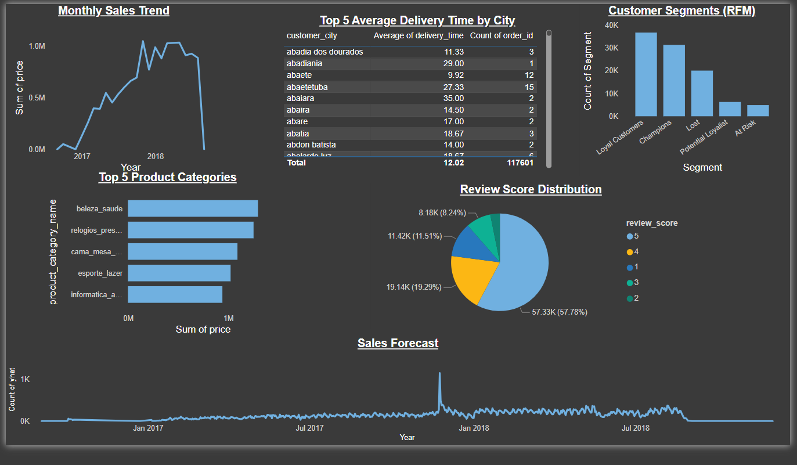

# 📊 E-commerce Analytics & Sales Forecasting

A full data analytics pipeline project using the Brazilian e-commerce dataset (Olist). This project covers data cleaning, exploratory analysis, customer segmentation (RFM), forecasting with Prophet, and Power BI dashboarding.

## 📁 Project Structure
- `data/`: Raw input CSV files
- `notebooks/`: Jupyter notebook(s) for full analysis
- `outputs/`: Cleaned datasets and RFM results
- `dashboard/`: Power BI visuals and .pbix file
- `README.md`: Project overview and insights
- `requirements.txt`: Python libraries used

## 🛠 Tools & Tech
- Python (Pandas, NumPy, Seaborn, Matplotlib)
- Power BI (for dashboarding)
- Prophet (for time series forecasting)
- Git, GitHub

## 🔍 Key Features
- RFM-based Customer Segmentation
- Sales Forecasting with Prophet
- Monthly Sales Trends & Category Analysis
- Interactive Dashboard in Power BI

## 📦 How to Run
1. Clone the repo:  
   `git clone https://github.com/your-username/Ecommerce-Analytics-Project.git`
2. Install requirements:  
   `pip install -r requirements.txt`
3. Open the Jupyter notebook in `/notebooks/`
4. Explore Power BI Dashboard in `/dashboard/`

## 📊 Dashboard Preview

## 📈 Insights & Recommendations
- Holiday months = highest sales.
- Loyal customers are electronics buyers.
- Delivery delays higher in metro areas.
